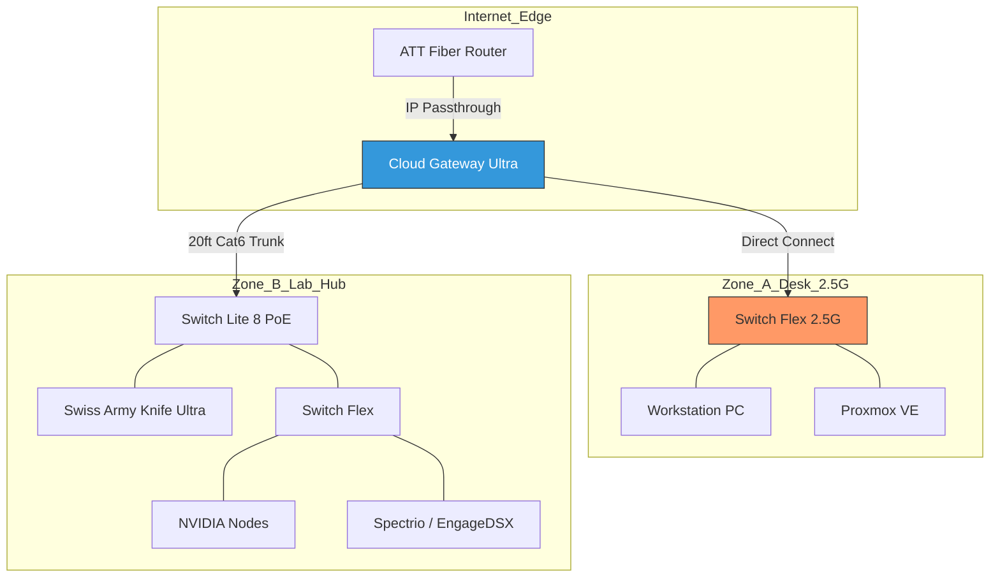

# WHITE_PAPER.md

## Project: Mas Wild Labs Network Architecture
**Author:** Mas Wild Labs  
**Ecosystem:** Ubiquiti UniFi  
**Status:** Phase 1 (Physical) Implemented | Phase 2 (Logical) Planned  

---

## 1. Executive Summary
This document outlines the design and implementation of a converged network infrastructure optimized for high-throughput virtualization (**Proxmox VE**), GPU-accelerated compute nodes (**NVIDIA**), and professional hardware testing (**Spectrio/EngageDSX**). 

The architecture leverages a **Cloud Gateway Ultra** and a **2.5GbE core** to ensure data velocity remains unhindered by traditional Gigabit bottlenecks, while a planned VLAN strategy provides micro-segmentation for security and testing.

---

## 2. Network Topology (Visual)
The following diagram illustrates the physical and logical flow of the Mas Wild Labs environment. GitHub will automatically render this text into a visual flowchart:

## 2. Network Topology (Visual)

### Physical Layout

### Logical Flow (Mermaid)
The following diagram illustrates the data flow within the UniFi ecosystem:

---

## 3. Layer 3 & Logical Segmentation
To maintain a professional-grade environment, the lab operates on the **172.16.0.0/24** address space. The following VLAN roadmap is designed to isolate broadcast domains and secure production assets from experimental hardware.

### VLAN Assignment Table
| VLAN ID | Name | Primary Function | Target Hardware |
| :--- | :--- | :--- | :--- |
| **0** | **Management** | Infrastructure Control | UCG-Ultra, All Switches, WAP |
| **10** | **Production** | High-Speed Compute | Primary PC, Proxmox VE |
| **20** | **Services** | IoT & Peripherals | Xbox, Wireless Clients, Printers |
| **30** | **Lab/Sandbox** | Experimental Tier | NVIDIA Compute, Spectrio Kiosks |

---

## 4. Hardware Manifest
| Component | Model | Role |
| :--- | :--- | :--- |
| **Gateway/Controller** | Cloud Gateway Ultra (UCG-Ultra) | L3 Routing & UniFi OS Console |
| **Core Switch** | UniFi Switch Flex 2.5G | 2.5Gbps High-Speed Backbone |
| **PoE Switch** | UniFi Switch Lite 8 PoE | Distribution & PoE Power Injection |
| **Access Point** | Swiss Army Knife Ultra (UK-Ultra) | Managed Wireless Fabric |
| **Lab Switch** | UniFi Switch Flex | PoE-Powered Lab Segment |

---

## 5. Design Decisions & Future Roadmap
* **IP Passthrough:** By bypassing the ATT router's NAT, the UCG-Ultra handles all security, providing a cleaner environment for technical writing labs and remote access.
* **PoE Daisy-Chaining:** The use of the PoE-powered Switch Flex in the Lab Hub minimizes cable clutter while providing enough ports for specialized hardware validation.
* **Phase 2 Implementation:** Deployment of Firewall Rules to restrict Inter-VLAN routing, specifically isolating the **Lab (VLAN 30)** from the **Production (VLAN 10)** environment.
